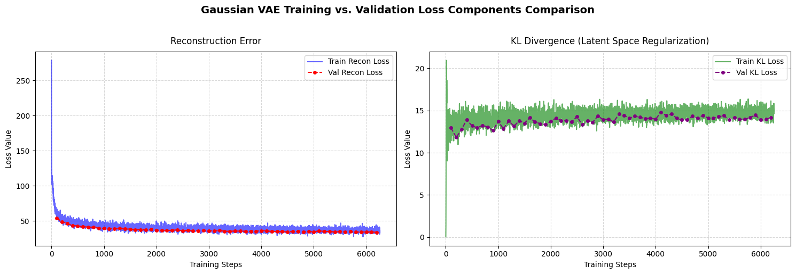
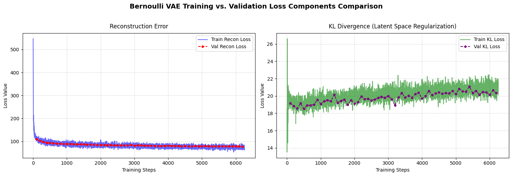
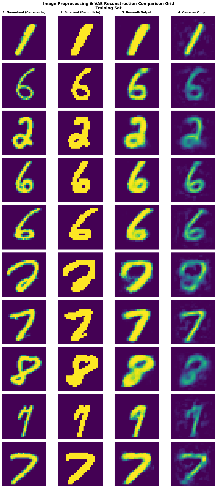
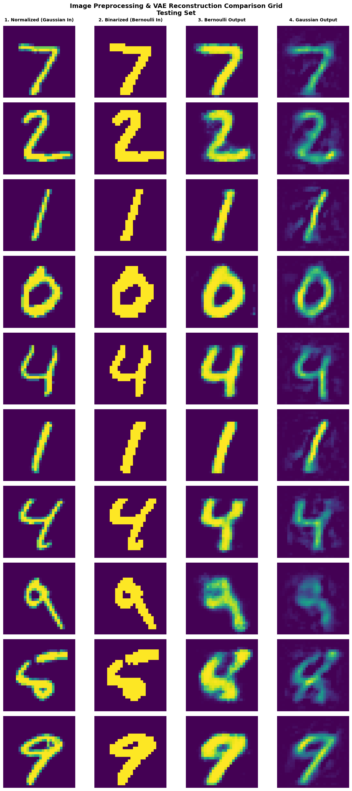
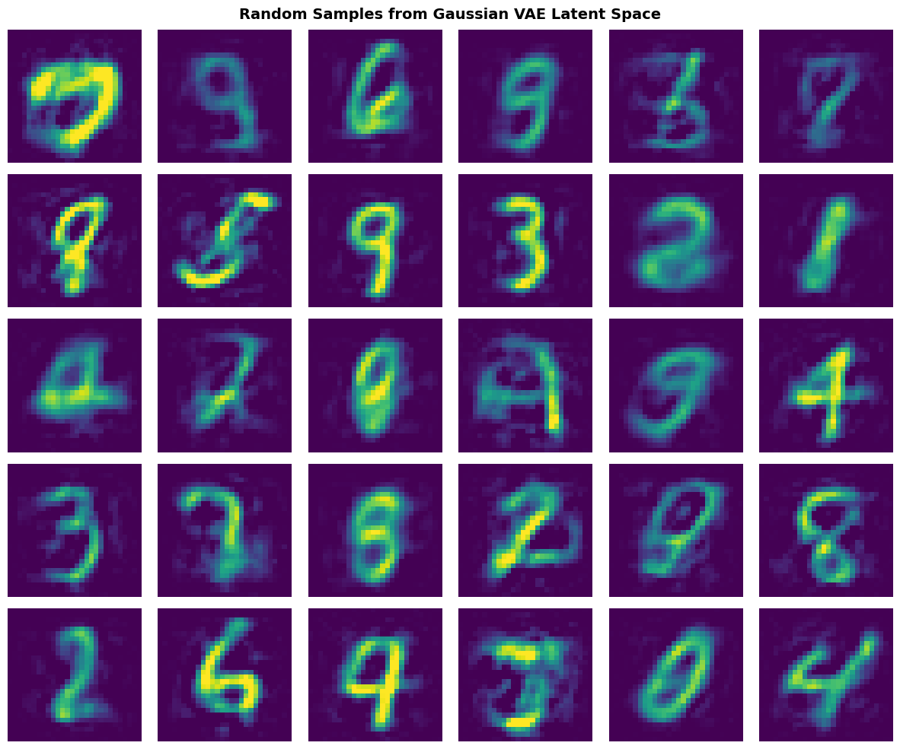
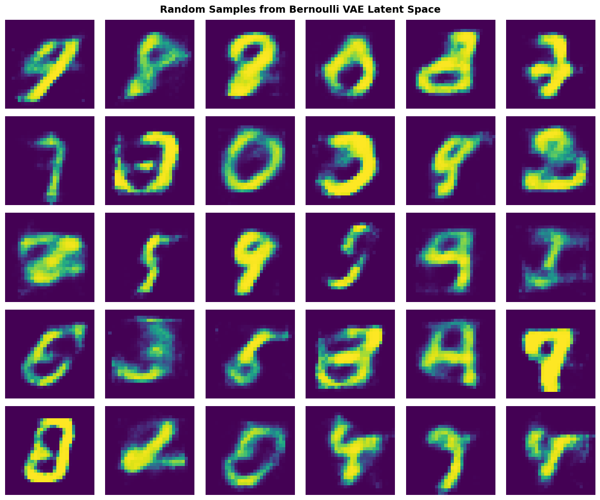

# Variational Autoencoder (VAE) on MNIST

A clean, modular PyTorch implementation of Variational Autoencoders (VAEs) applied to the MNIST dataset. This repository decouples the probabilistic encoder from the generative decoders, providing a robust experimental framework to analyze latent space representations, reconstruction quality, and generative sampling of handwritten digits.

---

## Model Architecture

The framework separates the encoder from multiple decoder strategies, allowing you to easily swap the underlying distribution assumption of the output space.

### Schematic Structure

* **Gaussian Encoder**
  * **Input Layer:** Receives a flattened MNIST image vector of size $784$ ($28 \times 28$ pixels).
  * **Hidden Layer:** Fully connected layer mapping from $784 \to 512$ units, utilizing a **ReLU** activation function.
  * **Latent Projections (Parallel Branches):**
    * **Mean ($\mu$):** Linear layer mapping from $512 \to \text{latent\_dim}$ (Identity activation). Represents the center of the latent distribution.
    * **Log-Variance ($\log(\sigma^2)$):** Linear layer mapping from $512 \to \text{latent\_dim}$ (Identity activation). Modeled in log-space to enforce strictly positive variances ($\sigma^2 = \exp(\text{logvar})$) and ensure numerical stability.

* **Decoder Variants (Selectable Paradigms)**
  * **Option A: Gaussian Decoder**
    * *Assumption:* Continuous output space.
    * *Structure:* Latent Vector ($z$) $\to$ Linear ($512$ units, ReLU) $\to$ Linear ($784$ units, Identity activation).
    * *Output:* Returns the continuous mean vector $\mu_x$ of the reconstructed pixels.
  * **Option B: Bernoulli Decoder**
    * *Assumption:* Input values are normalized continuous probabilities bounded in $[0, 1]$.
    * *Structure:* Latent Vector ($z$) $\to$ Linear ($512$ units, ReLU) $\to$ Linear ($784$ units, **Sigmoid** activation).
    * *Output:* Returns a vector of probabilities $p$ indicating the likelihood of each pixel being active.


---

## 📊 Graphical Results

Below are the experimental results achieved after training and evaluating both the Gaussian and Bernoulli VAE variants on the MNIST dataset.

### 1. Training Dynamics & Convergence (Loss Components)
The plots below show the optimization trajectory over training epochs. The total loss is broken down into its two core components: the **Reconstruction Loss** (BCE or MSE) and the **KL Divergence** regularizer.

* Gaussian VAE Loss Components:
  

* Bernoulli VAE Loss Components:
  

---

### 2. Digital Reconstruction Fidelity
A visual comparison displaying the network's capacity to reconstruct input images after compressing them into the bottleneck latent space. This highlights how well the structural features of the handwritten digits are preserved during both training and testing phases.

* **Training Set Performance:**
  
* **Testing Set Performance (Generalization):**
  

---

### 3. Generative Sampling & Synthesis
These grids showcase the generative capabilities of both models. By sampling latent vectors directly from the prior distribution $z \sim \mathcal{N}(0, I)$ and passing them through the respective trained decoders, the network synthesizes entirely new, realistic handwritten digits.

#### Gaussian Decoder Synthesis


#### Bernoulli Decoder Synthesis


---

## 🚀 Getting Started

### Prerequisites
Install the required dependencies listed in the file:
```bash
pip install -r requirements.txt
```

### File Structure
- `vae.py`: Core implementation of the VAE architecture, including the encoder and decoder classes.
- `vae-minst.ipynb`: Jupyter Notebook for training, evaluation, and visualization of the VAE on the MNIST dataset.